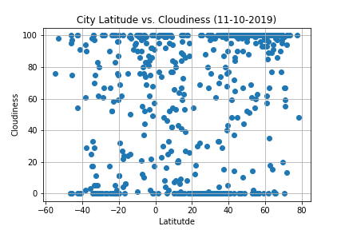
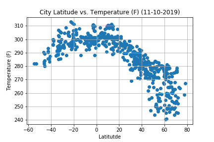
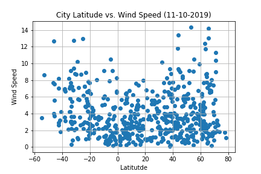

# API Challenge

## Overview:
Assignment in which the OpenWeatherMap API data was pulled using an API key to visualize the weather of 500+ cities across the world of varying distance from the equator. 

## Data:
The data was pulled from the OpenWeatherMap API using an API key. 

## Workflow:

The latitude and longitude values were stored in a list, and the city data is generated based on random coordinates. Other factors pulled for each city were maximum temperature, wind speed, cloudiness percentage and humidity percentage. The data was used to graph the following scatter plots using Matplotlib:

Cloudiness (%) vs. Latitude
Temperature (F) vs. Latitude
Humidity (%) vs. Latitude
Wind Speed (mph) vs. Latitude

Randomly select at least 500 unique (non-repeat) cities based on latitude and longitude.
Perform a weather check on each of the cities using a series of successive API calls.

## Observations:

- On 11/10/2019, latitude had no effect on cloudiness:

- On 11/10/2019, as latitude increased, temperature decreased:

- On 11/10/2019, latitude had no effect on humidity. However, at high latitude values, the humidity percentage increased and the wind speed decreased:

